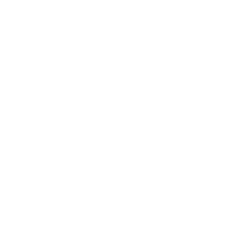

  

#### *DISCLAIMER: This application is a work-in-progress.*

## Overview
  
Welcome to Chess Realm, a multiplayer chess web application where you can host rooms to challenge your friends to a game of chess!

Chess Realm is a multiplayer chess application designed to bring together friends and chess enthusiasts of all skill levels for a friendly game of chess. With its minimalistic interface and interactive board, users can enjoy a competitive experience with no interruptions.

## Dependencies

**React.js:** Free and open-source front-end JavaScript library for building user interfaces based on components. [https://react.dev/](https://react.dev/)

**react-chessboard:** A React component that provides chessboard functionality to your application.
[https://www.npmjs.com/package/react-chessboard](https://www.npmjs.com/package/react-chessboard)

**chess.js:** a TypeScript chess library used for chess move generation/validation, piece placement/movement, and check/checkmate/stalemate detection.
[https://github.com/jhlywa/chess.js/blob/master/README.md](https://github.com/jhlywa/chess.js/blob/master/README.md)

**Socket IO:** a library that enables low-latency, bidirectional and event-based communication between a client and a server.
[https://socket.io/](https://socket.io/)

**Material UI:** open-source React component library that implements Google's Material Design.
[https://mui.com/material-ui/](https://mui.com/material-ui/)

## Functionality

In Chess Realm, users must create or join rooms to facilitate a space for chess play. The initial page will prompt users to input a username. A minimalistic landing page will load consisting of two buttons: `JOIN ROOM` and `CREATE ROOM`. When a room is created, the user will be redirected to a new page consisting of a chess board, a player list, and the room ID. To join a room, the invitee must receive the room ID from another user. This ID will allow the user to join that given room when submitting the specified input (found when clicking `JOIN ROOM`).

When a game is complete, or a person disconnects, the room will disconnect and another room would have to be made.

## TO-DO (next steps)

Below is a list of features that will be added as I continue to develop this program (in no particular order):

- Basic Features
	- Implementation of proposed front-end design in `"assets/design.png"`
	- Implementation of responsive website design
	- Refactor code for scalability
	- Fix bugs in move handling (e.g. users can move pieces before other players join)
- Advanced Features
	- Spectators and live chatrooms running in parallel to chess games
	- Log In/Sign Up Authentication
	- Implementation of a encrypted database to store rooms (rather than using a HashMap)
- Installation
	- After basic website features are implemented, the program will be (hopefully) hosted to a domain (that supports server-to-client communication)